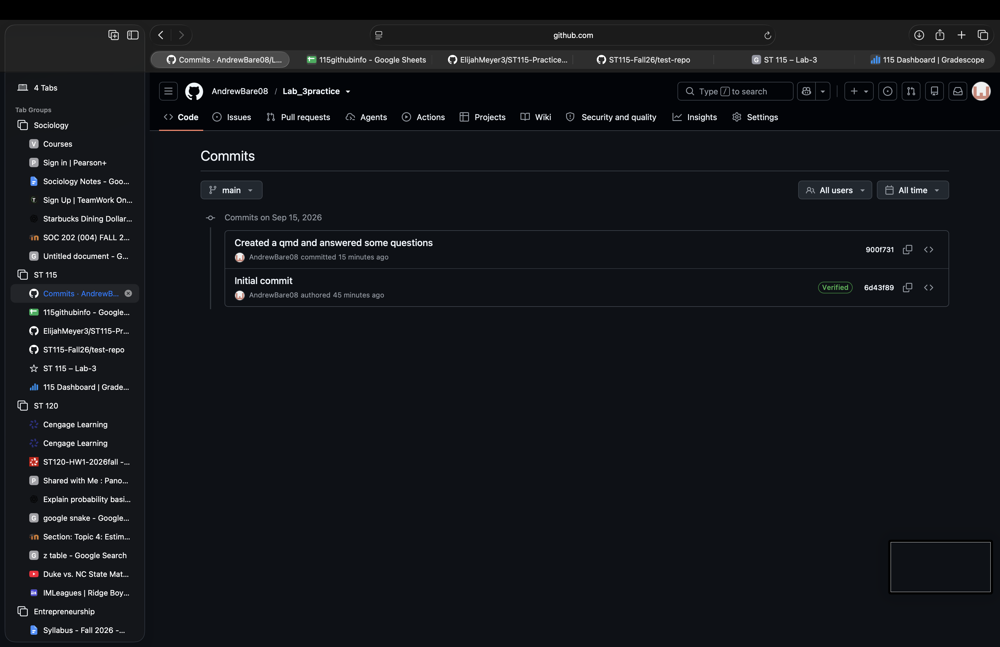

## Question 1

When processing pull the message that shows up is "already up to date". This makes sense because I have more files that github at the moment.

## Questions 2

This should be typed in the console because it gets saved in the library if typed in the console.

## Question 3

It should go in my .qmd file because it can be accessed at any time.

## Question 4

```{r}
palmerpenguins:: penguins
```

It didn't work at first because we didn't install that package.

## Question 5

No

## Question 6

```{r}
suppressWarnings(library(dplyr))
```

```{r}
library(dplyr)
```

I saw the warning notice at first but then I used the suppressWarnings tool to get rid of this message.

## Question 7

```{r}
iris2<- arrange(iris, Petal.Length)

iris2
```

## Question 8

{fig-align="center"}
